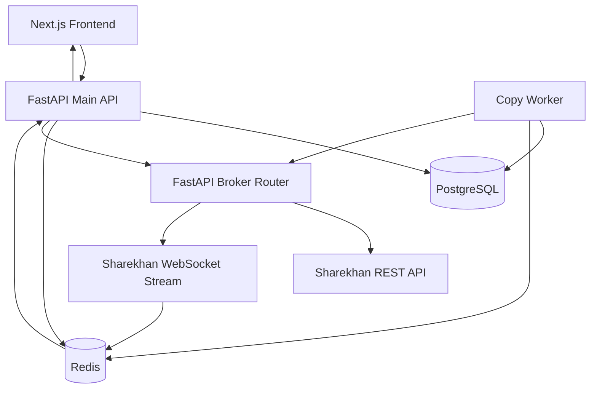

# Copy Trading Platform

A production-oriented copy trading monorepo for Mirae Asset Sharekhan accounts. The platform separates the user-facing API from a broker-router service that talks to raw Sharekhan HTTP/WebSocket endpoints. The official SDK is not imported at runtime.

Paper trading is enabled by default through `PAPER_TRADING_MODE=true`. In that mode, broker-router order endpoints return simulated broker responses and no live Sharekhan order is sent.

## Architecture



## Repository Layout

```txt
apps/
  web/             Next.js App Router frontend
  api/             Main FastAPI backend
  broker-router/   FastAPI Sharekhan raw endpoint router
  worker/          Background copy trading worker
packages/
  shared/          Shared TypeScript constants and types
```

## Detailed Documentation

Complete source-level documentation is available in [`docs/README.md`](docs/README.md), with focused guides for architecture, data model, API behavior, broker-router, copy worker, frontend, configuration/deployment, security/risk, and operations/testing.

## Setup

1. Copy `.env.example` to `.env`.
2. Set `JWT_SECRET` and a strong `APP_SECRET_KEY`. Use a 32-byte base64 value for production.
3. Keep `PAPER_TRADING_MODE=true` until you have verified routing, risk rules, logs, and reconciliation.
4. Start the stack:

```bash
docker compose up --build
```

5. Compose runs migrations automatically by default through `RUN_MIGRATIONS=true`. To apply them manually, or when `RUN_MIGRATIONS=false`, run:

```bash
docker compose exec api alembic upgrade head
```

The frontend runs at `http://localhost:3000`, the main API at `http://localhost:8000`, and broker-router at `http://localhost:8001`.

## Sharekhan Credential Setup

Create broker accounts from the Accounts page or `POST /accounts`. Store the Sharekhan API Key, Secure Key, optional vendor key, and optional proxy scheme/host/port/ID/password details. Customer ID and channel user can be filled automatically during Sharekhan callback token exchange. The API encrypts credentials, sensitive proxy fields, request tokens, and access tokens with AES-GCM before writing to PostgreSQL and masks secrets in responses.

## Connecting Accounts

1. Create a `MASTER` broker account for the source account.
2. Create one or more `COPY` broker accounts.
3. Open the Sharekhan login from the Accounts page row action, or use the central Login button for selected/all accounts.
4. The app generates the Sharekhan login URL with `POST /accounts/{id}/sharekhan/login-url`, including a random numeric `state` value for callback account matching.
5. Configure the Sharekhan API callback URL as `http://localhost:3000/sharekhan/callback` locally, or `https://your-domain.com/sharekhan/callback` in production.
6. After Sharekhan redirects back with `request_token`, the frontend calls `POST /accounts/sharekhan/callback`; the API saves the raw request token and immediately asks broker-router to exchange it for the Sharekhan access token/profile identity.
7. Open the account accordion in Accounts to view the stored/masked login details. Opening the accordion no longer calls Sharekhan's access-token endpoint again.
8. Create a copy group and add enabled copy accounts.
9. Configure sizing, symbol filters, transaction filters, product mapping, and max order limits in Risk Settings.

If an account shows `CREDENTIALS_LOCKED`, the encrypted fields were stored under a different `APP_SECRET_KEY` or are unreadable. Edit the account, enter the API Key and Secure Key again, and re-enter or clear optional vendor/proxy details.

## Running the Worker

The worker listens for copy jobs from Redis and can also be extended for periodic reconciliation. In Docker Compose it starts automatically:

```bash
docker compose up worker
```

Copy jobs should include the normalized master order payload. The worker enforces idempotency and retries failed copy orders up to three times with exponential backoff.

## Testing Order Placement Safely

Leave this setting enabled:

```env
PAPER_TRADING_MODE=true
```

Then place a test order through the broker-router or copy worker. The broker-router returns a simulated order ID prefixed with `PAPER-` and does not send an HTTP request to Sharekhan. Only set `PAPER_TRADING_MODE=false` after validating credentials, market-hours checks, risk rules, and copy settings in a controlled environment.

## Tests

Python tests cover URL/header construction, token masking, encryption, order validation, quantity calculation, risk validation, idempotency keys, and retry behavior.

```bash
docker compose run --rm api python -m pytest
docker compose run --rm broker-router python -m pytest
docker compose run --rm worker python -m pytest
```

## Raw Sharekhan Endpoints

The broker-router uses these raw routes:

```txt
POST /skapi/services/access/token
GET  /skapi/services/limitstmt/{exchange}/{customerId}
POST /skapi/services/orders
GET  /skapi/services/reports/{customerId}
GET  /skapi/services/trades/{customerId}
GET  /skapi/services/reports/{exchange}/{customerId}/{orderId}
GET  /skapi/services/orders/{exchange}/{customerId}/{orderId}/trades
GET  /skapi/services/holdings/{customerId}
GET  /skapi/services/master/{exchange}
GET  /skapi/services/historical/{exchange}/{scripcode}/{interval}
```

The runtime code intentionally avoids importing `SharekhanConnect`.
