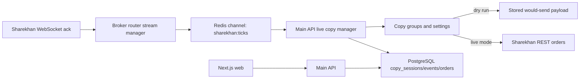

# Sharekhan Copy Trading App Documentation

This documentation describes the current `Sharekhan_copy_trading_app` codebase as implemented in this repository. It is written from the source files under `apps/`, `packages/`, `docker-compose.yml`, `.env.example`, migrations, and tests.

The app is a production-oriented copy trading monorepo for Mirae Asset Sharekhan accounts. It separates user-facing application concerns from broker communication, keeps paper trading enabled by default, and stores broker credentials encrypted in PostgreSQL.

Broker accounts can optionally store structured proxy details: scheme, host, port, ID/username, and password. When present, broker-router composes the proxy URL internally and sends that account's Sharekhan REST API requests through the configured proxy.

Sharekhan account setup follows the official credential model: enter the API Key and Secure Key, plus an optional vendor key. Customer ID and channel user are optional at creation time because the app fills them from the Sharekhan profile/access-token response when available.

Account login is available from each account accordion item and from a central selected/all account action. Login URLs include a random numeric `state`; Sharekhan should redirect to `/sharekhan/callback` with that `state` and a `request_token`. The callback uses the state to find the account, saves the raw request token, and immediately exchanges it through broker-router for the Sharekhan access token/profile identity. Opening the account accordion only shows stored details.

## Documentation Map

| Document | Purpose |
| --- | --- |
| [Architecture](architecture.md) | System overview, service responsibilities, runtime flows, and trust boundaries. |
| [Data Model](data-model.md) | Database entities, enums, relationships, migration notes, and data ownership. |
| [Main API](main-api.md) | FastAPI backend behavior, authentication, endpoint reference, schemas, and workflow notes. |
| [Broker Router](broker-router.md) | Sharekhan raw HTTP/WebSocket integration, paper trading behavior, token exchange, and broker endpoints. |
| [Sharekhan API Postman Study](sharekhan-api-postman.md) | Postman-derived Sharekhan REST endpoint map, request-token encryption flow, variables, and integration notes. |
| [UI Specification](ui-spec.md) | Portable UI/design-system contract for recreating this app's shadcn/zinc/Poppins interface in another project. |
| [Live Copy Trading](live-copy-trading.md) | Sharekhan WebSocket ack ingestion, dry-run session controls, copied-order persistence, and smoke test flow. |
| [Script Master Search And Watchlist](script-master-search-and-watchlist.md) | Script Master search, account-scoped watchlists, API contracts, durable snapshots, UI workflow, and verification. |
| [User Import And Export](user-import-export.md) | Admin-only full user-record archives, JSON format, import behavior, security requirements, and verification. |
| [Copy Worker](copy-worker.md) | Redis job shape, risk engine, sizing rules, retry/idempotency behavior, and persistence. |
| [Frontend](frontend.md) | Next.js app structure, routes, data sources, UI components, and current integration status. |
| [Configuration And Deployment](configuration-and-deployment.md) | Environment variables, Docker Compose, migrations, runtime commands, and production checklist. |
| [Security, Risk, And Safety](security-risk-and-safety.md) | Credential protection, JWT/RBAC, broker safety switches, risk controls, and live-trading readiness. |
| [Testing And Operations](testing-and-operations.md) | Test suites, smoke tests, health checks, troubleshooting, and operating notes. |

## Quick Facts

| Area | Current implementation |
| --- | --- |
| Monorepo services | `apps/web`, `apps/api`, `apps/broker-router`, `apps/worker`, `packages/shared` |
| Frontend | Next.js 15 App Router, React 19, Tailwind, React Query, Recharts |
| Main backend | FastAPI, SQLAlchemy async, Alembic, JWT auth, AES-GCM secret encryption |
| Broker integration | FastAPI broker-router using raw Sharekhan HTTP routes and WebSocket URL |
| Worker | Async Python Redis consumer that places copy orders through broker-router |
| Datastores | PostgreSQL 16, Redis 7 |
| Default safety mode | `PAPER_TRADING_MODE=true`, `COPY_TRADING_DRY_RUN=true` |
| Main ports | web `3000`, API `8000`, broker-router `8001`, Postgres `5432`, Redis `6379` |
| Sharekhan SDK usage | Runtime code intentionally does not import `SharekhanConnect` |

## Current Maturity Snapshot

The backend services contain the core operational model: users, account storage, token exchange, copy groups, copy settings, order read models, risk validation, broker order routing, copy session persistence, and dry-run-first WebSocket live copy trading.

Several pieces are intentionally scaffolded or require an external producer:

- The web UI is API-backed for login, dashboard metrics, account CRUD, copy groups, order/portfolio tables, and logs. Screens without persisted records show empty states instead of demo rows.
- Account responses tolerate unreadable encrypted fields and mark those accounts as `CREDENTIALS_LOCKED` so operators can re-save credentials or clear optional vendor/proxy details instead of losing access to the account list.
- The legacy worker still consumes Redis jobs from the `copy_jobs` list for queued copy jobs.
- The worker expects the `master_order_id` in a job to refer to an existing `master_orders` row because `copy_orders.master_order_id` has a foreign key.
- The main API WebSocket endpoint `/ws/live` currently emits a heartbeat only.
- The broker-router WebSocket manager connects to Sharekhan, sends the confirmed `subscribe`/`feed`/`ack` frames, and publishes stream messages to Redis. The main API live copy manager consumes order ack messages and writes `copy_sessions`, `master_trade_events`, and `copied_trade_orders`.

## Safe First Run Checklist

1. Copy `.env.example` to `.env`.
2. Keep `PAPER_TRADING_MODE=true` until every workflow is validated.
3. Replace `JWT_SECRET` and `APP_SECRET_KEY` with strong production values before using real accounts.
4. Start the stack with `docker compose up --build`.
5. Let the API container run migrations automatically with `RUN_MIGRATIONS=true`, or run `docker compose exec api alembic upgrade head` manually.
6. Register a user from the login screen's Create account mode, or with `POST /auth/register`.
7. Add one `MASTER` account and at least one `COPY` account using each account's API Key and Secure Key.
8. Configure the Sharekhan callback URL as `http://localhost:3000/sharekhan/callback`, open account login from the Accounts page, complete broker login, confirm access token status on the callback/accounts page, create copy groups, and configure each copy member's risk settings from the copy group detail page.
9. Keep `COPY_TRADING_DRY_RUN=true` while testing `/live-copy`; only after controlled testing should `PAPER_TRADING_MODE=false` and `COPY_TRADING_DRY_RUN=false` be considered.

## High-Level Flow

## Source Of Truth

The docs describe the code as it exists now. When code and docs disagree, update the docs in the same change as the code. The most important source files are:

- `apps/api/app/main.py`, `apps/api/app/models.py`, `apps/api/app/routers/*`
- `apps/broker-router/app/main.py`, `apps/broker-router/app/brokers/sharekhan/client.py`
- `apps/worker/app/risk.py`, `apps/worker/app/engine.py`, `apps/worker/app/main.py`
- `apps/web/app/*`, `apps/web/components/*`, `apps/web/lib/api.ts`
- `apps/api/alembic/versions/0001_initial_schema.py`
