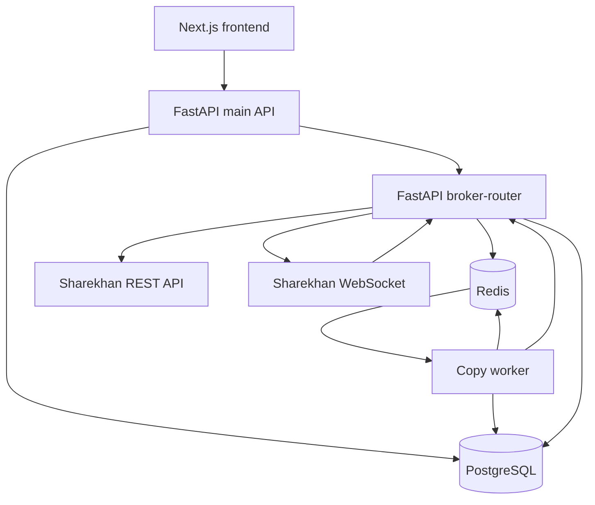
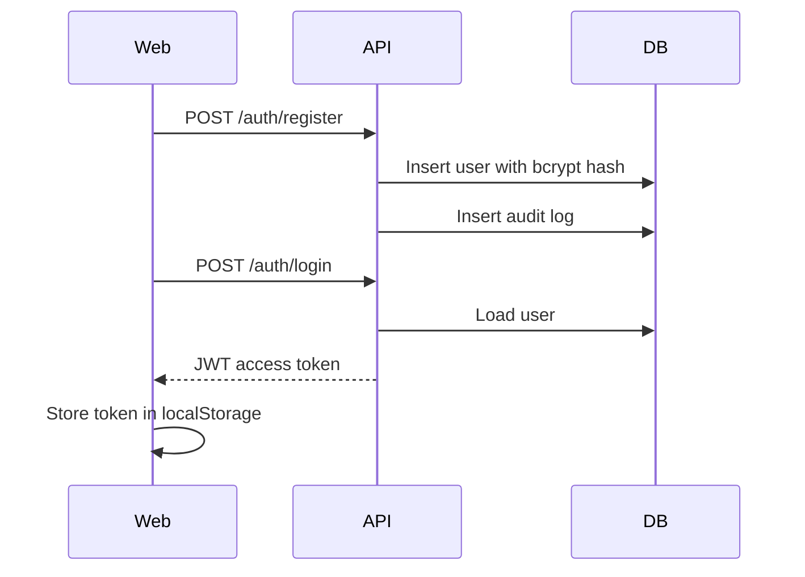
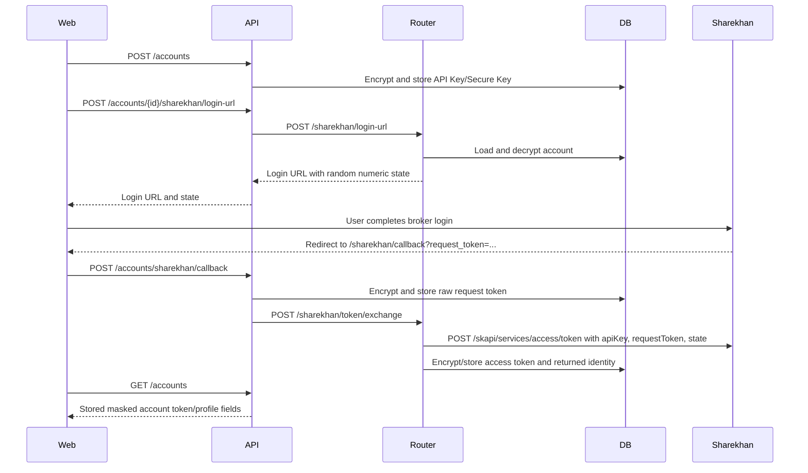
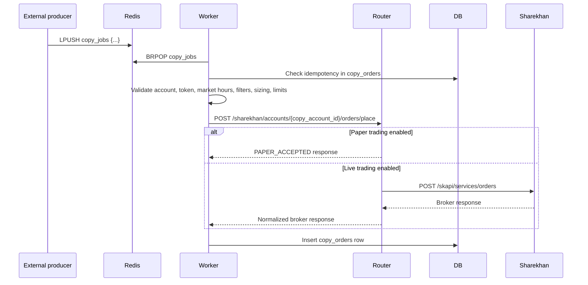

# Architecture

The application is organized as a multi-service monorepo. Each service has a narrow responsibility so broker communication, copy execution, user-facing APIs, and UI behavior can evolve independently.

## Runtime Components

| Component | Path | Responsibility |
| --- | --- | --- |
| Web app | `apps/web` | Next.js operator UI for login, dashboards, accounts, copy groups, orders, portfolio views, risk settings, logs, and settings. |
| Main API | `apps/api` | User authentication, account CRUD, credential encryption, copy group/settings management, dashboard metrics, read-only order/portfolio/log APIs. |
| Broker router | `apps/broker-router` | Internal broker gateway that decrypts account credentials, builds raw Sharekhan HTTP requests, handles token exchange, places orders, and manages Sharekhan WebSocket sessions. |
| Copy worker | `apps/worker` | Redis queue consumer that turns master order jobs into copy orders after risk checks and broker-router placement. |
| Shared package | `packages/shared` | TypeScript constants and common frontend-facing types. |
| PostgreSQL | Docker service | Durable data store for users, accounts, settings, orders, portfolio snapshots, ticks, and audit logs. |
| Redis | Docker service | Queue for copy jobs and pub/sub transport for stream messages and stream errors. |

## Service Diagram

## Responsibilities By Boundary

### Web App

The web app presents operator-facing screens. It uses:

- `apiFetch` for JSON API calls with a bearer token from `localStorage`.
- `React Query` for dashboard metrics.
- Tailwind-based local UI primitives in `components/ui`.
- Live API-backed tables with empty states when no records exist.

The web app does not directly talk to broker-router or Sharekhan.

### Main API

The main API is the public backend boundary for authenticated users. It owns:

- User registration and login.
- JWT issuing and request authentication.
- User/account access checks.
- Encrypted broker account storage.
- Sharekhan login URL delegation, public callback request-token storage, immediate token-exchange delegation, and stored profile display.
- Copy group and copy setting CRUD.
- Read models for orders, positions, holdings, trades, logs, and dashboard metrics.
- Delegation to broker-router for Sharekhan login URL generation and profile/access-token exchange.

### Broker Router

The broker-router is an internal service. It loads account credentials from PostgreSQL, decrypts them, and talks to raw Sharekhan endpoints. The service applies:

- Per-client in-memory rate limiting.
- Access-token checks for broker data/order endpoints.
- Paper-order simulation when `PAPER_TRADING_MODE=true`.
- Raw WebSocket connection management for Sharekhan streams.

It does not authenticate user JWTs. It is intended to sit on an internal network behind the main API and worker.

### Copy Worker

The worker is the execution engine. It blocks on the Redis list named by `copy_job_queue` and processes JSON jobs containing:

- A normalized master order.
- One or more copy targets.
- Per-target account metadata and copy settings.

For each target, it checks duplicate idempotency, validates risk rules, builds a Sharekhan order payload, sends it to broker-router, retries transient failures, and writes a `copy_orders` row.

## Primary Workflows

### 1. User Authentication

### 2. Broker Account Onboarding

### 3. Copy Group Setup

1. Create one broker account with `account_type=MASTER`.
2. Create one or more broker accounts with `account_type=COPY`.
3. Create a copy group pointing to the master account.
4. Add copy account members to the group.
5. A default `copy_settings` row is created when a member is added.
6. Patch the copy settings to tune sizing, filters, price behavior, and risk limits.

### 4. Copy Order Execution

## Data Flow Summary

| Flow | Producer | Consumer | Transport | Durable write |
| --- | --- | --- | --- | --- |
| Web API calls | Browser | Main API | HTTP JSON | PostgreSQL for mutations |
| Sharekhan login URL | Main API | Broker router | HTTP JSON | None |
| Sharekhan callback request token | Browser | Main API | HTTP JSON with account id/state and request token | Encrypted raw `request_token` in `broker_accounts`, followed by broker-router token exchange |
| Sharekhan profile/access token | Main API | Broker router | HTTP JSON | Broker-router converts raw request token to `FinalEncryptedToken`, sends it to Sharekhan, and stores returned access token/identity |
| Copy jobs | External producer | Worker | Redis list `copy_jobs` | `copy_orders` |
| Broker order placement | Worker | Broker router | HTTP JSON | `copy_orders` by worker |
| Sharekhan feed / order ack messages | Sharekhan stream | Broker router | WebSocket | Redis pub/sub channel `sharekhan:ticks` today; future implementation should type or split feed and ack messages |
| Main live updates | Web | Main API | WebSocket | None, heartbeat only |

## Trust Boundaries

| Boundary | Important controls |
| --- | --- |
| Browser to main API | JWT bearer token, CORS restricted to configured origins. |
| Sharekhan callback to main API | Callback is public so the broker redirect can complete; the frontend supplies the pending account id captured before opening Sharekhan, while the backend can also match the stored numeric state. Use hard-to-guess account UUIDs and keep callback behavior limited to request-token storage plus the required broker-router token exchange. |
| Main API to database | SQLAlchemy async sessions, credential encryption before write. |
| Main API to broker-router | Internal service URL, no user JWT propagation. |
| Worker to broker-router | Internal service URL, copy account ID, broker-router token checks. |
| Broker-router to Sharekhan | Raw Sharekhan headers and access token, paper mode switch. |
| Redis queue | Job producer must be trusted because worker validates risk but assumes payload schema and target identity are valid. |

## Implementation Notes

- `PAPER_TRADING_MODE=true` only simulates place/modify/cancel order endpoints. Broker data endpoints still require valid stored access tokens.
- Account responses do not fail the entire account list when encrypted fields cannot be decrypted; those rows are marked `CREDENTIALS_LOCKED` for operator recovery.
- The worker does not create `master_orders`; it receives a `master_order.id` in the job and writes `copy_orders` against that ID.
- The main API exposes read endpoints for master/copy orders, positions, holdings, and trades, but ingestion/synchronization into those tables is not part of the current repository.
- Broker-router stream messages are published to Redis. The WebSocket manager sends the confirmed Sharekhan module, feed, and ack subscription frames, records recent inbound/outbound frames for diagnostics, and the main API live copy manager consumes order ack messages into `copy_sessions`, `master_trade_events`, and `copied_trade_orders`.
