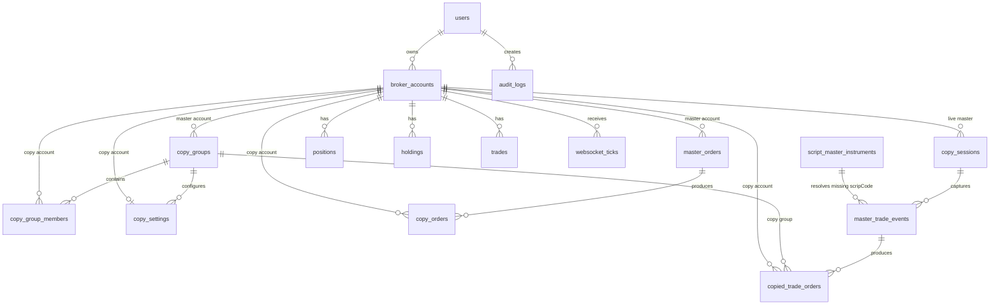

# Data Model

The main SQLAlchemy model definitions live in `apps/api/app/models.py`. The initial Alembic migration is `apps/api/alembic/versions/0001_initial_schema.py`.

PostgreSQL is the primary source of truth. The main API owns the ORM models. Broker-router and worker each declare partial SQLAlchemy Core table definitions for the columns they need.

## Enums

| Enum | Values | Used by |
| --- | --- | --- |
| `UserRole` | `ADMIN`, `USER` | Authorization and query scoping. |
| `Broker` | `SHAREKHAN` | Broker account type. |
| `AccountType` | `MASTER`, `COPY` | Defines source accounts and follower accounts. |
| `SizingMode` | `SAME_QTY`, `MULTIPLIER`, `FIXED_QTY`, `PERCENT_CAPITAL` | Copy order quantity calculation. |
| `PriceMode` | `SAME_PRICE`, `MARKET`, `LIMIT_WITH_SLIPPAGE` | Copy order price calculation. |
| `CopyOrderStatus` | `PENDING`, `SENT`, `SUCCESS`, `FAILED`, `SKIPPED`, `RETRYING` | Copy order lifecycle state. Current worker writes `SUCCESS`, `FAILED`, or `SKIPPED`. |

## Entity Relationship Overview



## Tables

### `users`

Stores application users.

| Column | Purpose |
| --- | --- |
| `id` | UUID primary key. |
| `email` | Unique login identifier, stored lowercased. |
| `password_hash` | Bcrypt password hash. |
| `role` | `ADMIN` or `USER`. |
| `is_active` | Disabled users cannot authenticate. |
| `created_at`, `updated_at` | UTC timestamps. |

### `broker_accounts`

Stores Sharekhan account metadata and encrypted credentials/tokens.

| Column | Purpose |
| --- | --- |
| `user_id` | Owner user. Non-admin API calls are scoped to this owner. |
| `broker` | Currently always `SHAREKHAN`. |
| `account_name` | Human-readable label. |
| `customer_id`, `login_id` | Optional Sharekhan identity fields. Callback/manual token exchange stores these when Sharekhan returns them. |
| `api_key`, `secret_key`, `vendor_key` | Encrypted credential fields. `secret_key` stores the Sharekhan Secure Key; `vendor_key` is optional. |
| `proxy_scheme`, `proxy_host`, `proxy_port`, `proxy_username`, `proxy_password` | Optional structured proxy details used for account-scoped Sharekhan REST API calls. Host, username, and password are encrypted. |
| `request_token` | Encrypted raw Sharekhan request token returned by the login callback, nullable before login. |
| `access_token`, `refresh_token` | Encrypted broker tokens, nullable before login. |
| `token_expires_at` | Optional token expiry returned by token exchange. |
| `account_type` | `MASTER` or `COPY`. |
| `is_active` | Used by risk checks and account management. |
| `last_connected_at` | Updated when broker-router stores access tokens. |

Secrets are decrypted only when broker-router needs to call Sharekhan or when the main API masks them for responses.

`credentials_readable` is not a database column. It is a computed API response flag. If any encrypted account field cannot be decrypted with the active `APP_SECRET_KEY`, the account list still returns the row with unreadable masked fields and `credentials_readable=false` so the frontend can show `CREDENTIALS_LOCKED`.

### `copy_groups`

Defines a named copy relationship around one master account.

| Column | Purpose |
| --- | --- |
| `name` | Group label. |
| `master_account_id` | Must point to a `MASTER` broker account at API validation time. |
| `is_active` | Group enabled flag. Current worker job processing relies on job payload and does not load this flag directly. |

### `copy_group_members`

Associates copy accounts with copy groups.

| Column | Purpose |
| --- | --- |
| `copy_group_id` | Parent group. |
| `copy_account_id` | Must point to a `COPY` broker account at API validation time. |
| `is_enabled` | Member enabled flag. |

Constraint: one copy account can appear only once per group through `uq_copy_group_member`.

### `copy_settings`

Defines per-copy-account settings within a copy group.

| Column | Purpose |
| --- | --- |
| `copy_account_id`, `copy_group_id` | Unique pair controlled by `uq_copy_settings_account_group`. |
| `sizing_mode` | Quantity calculation mode. |
| `multiplier` | Multiplier for `MULTIPLIER` mode. |
| `fixed_qty` | Fixed quantity for `FIXED_QTY` mode. |
| `capital_percent` | Percent allocation for `PERCENT_CAPITAL` mode. |
| `max_qty` | Optional hard quantity cap. |
| `max_order_value` | Optional hard notional value cap. |
| `allowed_symbols`, `blocked_symbols` | Symbol allow/block lists. |
| `allowed_transaction_types` | Side filters, default `["B", "S"]`. |
| `allowed_product_types` | Product filter list. Empty means no product restriction. |
| `product_type_map` | Master product type to copy product type mapping. |
| `price_mode` | Price transformation mode. |
| `max_slippage_percent` | Slippage percentage for `LIMIT_WITH_SLIPPAGE`. |
| `is_auto_squareoff_enabled` | Stored setting for square-off behavior. Current worker does not act on this flag. |
| `is_enabled` | Copy setting enabled flag used by worker risk validation. |

### `master_orders`

Stores normalized master account orders.

| Column | Purpose |
| --- | --- |
| `broker_order_id` | Broker-provided source order ID, indexed. |
| `master_account_id` | Master broker account. |
| `exchange`, `scrip_code`, `trading_symbol` | Instrument identity. |
| `transaction_type` | Side, usually `B` or `S`. |
| `quantity`, `price`, `trigger_price` | Master order sizing and price fields. |
| `order_type`, `product_type`, `request_type` | Broker order metadata. |
| `raw_payload`, `raw_response` | Original event/request data. |
| `status` | Broker/master status string. |

The current repository exposes read APIs for this table, but the ingestion path that creates master orders is not implemented here.

### `copy_orders`

Stores copy execution results.

| Column | Purpose |
| --- | --- |
| `master_order_id` | Foreign key to `master_orders`. |
| `copy_account_id` | Target copy account. |
| `broker_order_id` | Broker order ID returned by broker-router, nullable on failures/skips. |
| `status` | Copy order status. |
| `calculated_quantity`, `calculated_price` | Worker-calculated execution values. |
| `request_payload`, `response_payload` | Payload sent to broker-router and simplified response data. |
| `error_message` | Skip or failure reason. |
| `retry_count` | Number of retries attempted before final result. |
| `idempotency_key` | Unique SHA-256 key for duplicate prevention. |

The worker computes the idempotency key from:

```text
sha256("{master_order_id}:{copy_account_id}:{request_type.upper()}")
```

### `copy_sessions`

Tracks a live-copy run for one master account.

| Column | Purpose |
| --- | --- |
| `master_account_id` | Master account whose Sharekhan ack stream is consumed. |
| `status` | `RUNNING`, `PAUSED`, `STOPPED`, or `ERROR`. |
| `started_at`, `paused_at`, `resumed_at`, `stopped_at` | Session lifecycle timestamps. |
| `last_error` | Latest fatal session or stream error. |
| `active_group_ids` | JSON list of selected copy group UUIDs. |
| `dry_run` | Per-session guard that prevents live order placement when true. |
| `created_by` | User who started the session. |

### `master_trade_events`

Stores normalized executed master trade events captured from Sharekhan WebSocket ack messages.

| Column | Purpose |
| --- | --- |
| `session_id` | Live-copy session that captured the event. |
| `master_account_id` | Master broker account. |
| `external_trade_id`, `external_order_id` | Sharekhan trade/order identifiers when present. |
| `symbol`, `exchange`, `side` | Normalized instrument and side. |
| `quantity`, `price` | Executed quantity and trade/order price. |
| `order_type`, `product_type` | Broker order metadata used for child orders. |
| `raw_payload_json` | Full raw ack envelope plus `script_master_resolution` when missing `scripCode` was resolved or rejected. |
| `copied_status` | Aggregate result across child copy attempts: `PLACED`, `PARTIAL`, `FAILED`, or `SKIPPED`. |
| `duplicate_hash` | Session-scoped duplicate detector for repeated ack frames. |

Constraints:

- Unique `(session_id, external_trade_id)`.
- Unique `(session_id, duplicate_hash)`.

### `copied_trade_orders`

Stores each live-copy child order attempt for a normalized master trade event.

| Column | Purpose |
| --- | --- |
| `master_trade_event_id` | Parent master trade event. |
| `copy_group_id` | Copy group that selected the copier account. |
| `copier_account_id` | Target copy account. |
| `request_payload_json` | Sharekhan order payload that would be or was sent. |
| `response_payload_json` | Dry-run response, broker-router response, or skip/failure details. |
| `child_order_id` | Sharekhan child order id when placement succeeds and Sharekhan returns it. |
| `status` | `PLACED`, `FAILED`, `SKIPPED`, or `PENDING`. |
| `error_message` | Human-readable skip/failure reason. |

Constraint: unique `(master_trade_event_id, copier_account_id)` prevents duplicate child attempts for the same copied account.

### `script_master_instruments`

Stores normalized Sharekhan Scrip Master rows for fast, safe symbol resolution during live copy.

| Column | Purpose |
| --- | --- |
| `exchange` | Sharekhan exchange/segment code used to fetch the master data, for example `NC` or `NF`. |
| `segment` | Optional segment code from the raw master row. |
| `scrip_code` | Sharekhan numeric instrument code stored as text to preserve raw data. |
| `trading_symbol` | Normalized uppercase trading symbol. |
| `symbol_name` | Optional display/company symbol name from the master row. |
| `underlying_symbol` | Optional derivative underlying/root symbol. |
| `instrument_type` | Optional instrument type such as equity, future, or option code. |
| `option_type` | Optional `CE`/`PE` value for derivatives. |
| `strike_price` | Optional derivative strike price. |
| `expiry_date` | Optional derivative expiry date. |
| `lot_size` | Optional market lot size. |
| `isin` | Optional ISIN used to refine equity matching. |
| `raw_payload_json` | Original master row for diagnostics. |
| `refreshed_at` | Timestamp of the cache refresh that wrote the row. |

Constraints and indexes:

- Unique: `(exchange, scrip_code)`.
- Lookup indexes on `(exchange, trading_symbol)`, `(exchange, segment, trading_symbol)`, derivative fields, `underlying_symbol`, and `isin`.

The live copy flow uses this table only when a master WebSocket order acknowledgement is missing `scripCode`. If the cache is empty or older than `SCRIPT_MASTER_CACHE_TTL_HOURS`, the API refreshes the relevant exchange through broker-router before matching. If multiple different `scrip_code` values match, the copy order is skipped rather than placed blindly.

### `positions`

Stores position snapshots for broker accounts.

| Column | Purpose |
| --- | --- |
| `broker_account_id` | Account the position belongs to. |
| `exchange`, `scrip_code`, `trading_symbol` | Instrument identity. |
| `quantity`, `avg_price`, `pnl` | Position values. |
| `raw_payload` | Original broker payload. |
| `synced_at` | Snapshot timestamp. |

Current code exposes read APIs but does not include a sync worker.

### `holdings`

Stores holding snapshots.

| Column | Purpose |
| --- | --- |
| `broker_account_id` | Account owner. |
| `raw_payload` | Broker holding payload. |
| `synced_at` | Snapshot timestamp. |

Current code exposes read APIs but does not include a sync worker.

### `trades`

Stores trade snapshots.

| Column | Purpose |
| --- | --- |
| `broker_account_id` | Account owner. |
| `broker_trade_id` | Broker trade ID, nullable. |
| `exchange`, `scrip_code`, `trading_symbol` | Instrument identity. |
| `transaction_type`, `quantity`, `price` | Trade values. |
| `raw_payload` | Broker trade payload. |
| `traded_at`, `synced_at` | Broker time and sync time. |

### `audit_logs`

Stores user and system audit events created by the main API.

| Column | Purpose |
| --- | --- |
| `user_id` | Actor, nullable with `SET NULL` if user is deleted. |
| `action` | Action name such as `auth.login`, `broker_account.create`, or `copy_setting.update`. |
| `entity_type`, `entity_id` | Entity touched by the action. |
| `metadata` | JSON metadata. SQLAlchemy model exposes this as `metadata_`. |
| `created_at` | Event timestamp. |

### `websocket_ticks`

Stores normalized tick data, but the current broker-router publishes stream messages to Redis instead of inserting rows here.

| Column | Purpose |
| --- | --- |
| `broker_account_id` | Account tied to the stream. |
| `symbol`, `exchange` | Instrument identity. |
| `tick_data` | Raw or normalized tick payload. |
| `received_at` | Receipt timestamp. |

## Data Ownership

| Service | Tables read | Tables written |
| --- | --- | --- |
| Main API | All ORM tables relevant to endpoints | `users`, `broker_accounts`, `copy_groups`, `copy_group_members`, `copy_settings`, `script_master_instruments`, `audit_logs` |
| Broker-router | Partial `broker_accounts` | `broker_accounts.access_token`, `refresh_token`, `token_expires_at`, `last_connected_at`, `customer_id`, `login_id` |
| Worker | Partial `copy_orders` | `copy_orders` |
| Web | None directly | None directly |

## Migration Notes

The initial migration creates all enums and tables. Later migrations add account-scoped proxy fields, make Sharekhan identity fields nullable so accounts can be created with only API Key and Secure Key, add encrypted raw request-token storage, add live-copy trading tables, and add the Script Master cache table. To apply all migrations:

```bash
docker compose exec api alembic upgrade head
```

To create future migrations, run Alembic from inside the API environment so `app.core.config` and `app.db.base` resolve correctly.

## Consistency Notes

- Application-level checks ensure a copy group uses a `MASTER` account and members use `COPY` accounts.
- Database foreign keys protect table relationships but do not encode every business invariant.
- `copy_orders.idempotency_key` is unique and is the main duplicate protection for worker processing.
- The worker writes `calculated_price` from `request_payload.price`. Risk-rejected or duplicate skipped orders save an empty payload and therefore store `0`.
- Changing `APP_SECRET_KEY` without re-encrypting account data does not change table rows, but it makes encrypted fields unreadable until the original key is restored or credentials are re-saved.
